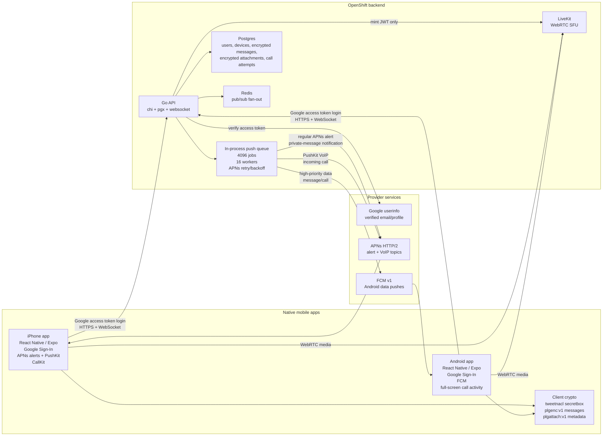

# Architecture

Phone LevelG is a private iOS/Android messaging and calling app for a trusted home or VPN network. The mobile apps own the user experience and client-side encryption. The Go backend owns identity validation, durable encrypted message storage, live signaling, native push fan-out, and LiveKit token minting. LiveKit carries media only.

## System Layout

## Backend

The backend lives in `apps/server` and is intentionally small:

- validates Google access tokens through `userinfo`
- gates private-server access with the invite code
- keys accounts by normalized Google email
- allows duplicate display names across different email accounts
- stores opaque encrypted message envelopes and encrypted attachment blobs
- enforces direct-room access for 1-1 messages, attachments, and deletion
- keeps a device registry for iOS APNs alert tokens, iOS PushKit VoIP tokens, and Android FCM tokens
- sends native message and call pushes through an async push queue
- caches APNs provider JWTs to avoid Apple `TooManyProviderTokenUpdates`
- retries APNs `429` and `5xx` responses with backoff
- broadcasts live chat/call events through Redis
- mints LiveKit room tokens
- exposes OpenShift health probes

Postgres is the durable system of record. Redis is ephemeral coordination for WebSocket fan-out. The backend never carries audio/video media.

## Mobile

The mobile app lives in `apps/mobile` and is built with React Native through Expo plus native iOS/Android projects.

The app provides:

- native Google Sign-In on Android and iOS
- a shared `Home` lobby room
- a member/contact strip
- hidden direct 1-1 chats opened from contacts
- direct-chat deletion
- encrypted message bodies for new messages
- encrypted picture and document attachments in direct chats
- inline decrypted image previews for picture attachments
- emoji quick actions and compact cat-meme quick messages
- a settings gear that owns local options such as private-message sound and microphone/camera preferences
- native private-message push sounds for 1-1 chats only
- lobby messages that intentionally stay silent
- LiveKit-backed voice/video calls
- iOS PushKit + CallKit incoming-call handling
- Android FCM + full-screen incoming-call handling

Private conversations are not lobby objects. Both clients compute the same direct room ID from the two user IDs, and the backend rejects direct-room access from any other user.

## Push Delivery

Push delivery is part of the backend runtime, not a mobile-only feature.

Regular messages:

- active clients receive WebSocket `message:new`
- inactive iPhones receive regular APNs alert pushes
- inactive Android devices receive FCM pushes
- iOS VoIP pushes are not used for chat messages

Calls:

- active clients receive WebSocket `call:ring`
- iOS devices receive PushKit VoIP pushes and report CallKit immediately
- Android devices receive high-priority FCM data pushes and show a full-screen incoming-call activity
- LiveKit join happens only after the user accepts

The APNs provider requires an Apple-issued Auth Key in the OpenShift `phone-levelg-server` Secret. The `.p8` key is stored only in ignored local files and OpenShift Secret data, never in Git. Current Xcode-installed development builds use the APNs sandbox endpoint; distribution/TestFlight/App Store builds must use the production APNs endpoint.

The push worker queue is deliberately larger than normal household usage: 4096 queued jobs and 16 workers. It handles message bursts without blocking HTTP message persistence. It is in-process, so it is not a durable queue across pod restarts; Redis/Postgres-backed push jobs are the future step if guaranteed delivery through server restarts becomes required.

## Calls And Media

LiveKit is the media SFU. The backend only mints JWTs from `/calls/token`; mobile clients connect directly to LiveKit for audio/video.

OpenShift exposes LiveKit with MetalLB on the libvirt network. The host forwards LAN/VPN traffic to that LoadBalancer IP:

- `7880/TCP`: LiveKit signaling
- `7881/TCP`: TCP media fallback
- `50100-50120/UDP`: WebRTC media

The OpenShift LiveKit secret must use a real key and a secret of at least 32 characters. The old `devkey:secret` local-development pair is not valid for deployed use.

## Privacy Model

The app is intended to be reachable only from the home network or VPN:

- keep OpenShift Routes private or firewall-restricted
- expose LiveKit only through the same trusted network path
- use invite-code access only for trusted users
- keep Apple, Firebase, Google, and LiveKit secrets out of Git
- back up Postgres and Redis PVCs according to the cluster storage policy

New message bodies and direct-chat attachment bytes are encrypted on the mobile client before they are sent to the backend. The backend stores and relays opaque `plgenc:v1` message envelopes and encrypted attachment blobs. Mobile clients decrypt fetched history, websocket `message:new` payloads, downloaded files, and inline image previews locally with `tweetnacl` secretbox.

Current limitation: this phase derives room keys from a server-confirmed session key secret plus room ID. That removes plaintext message bodies from backend storage and relay, but the stronger target remains per-account/per-device key material with encrypted room-key fan-out for up to three devices per Gmail account.

## Deployment Shape

OpenShift runs only backend and infrastructure:

- Go API Deployment built from committed GitHub source
- Postgres StatefulSet and PVC
- Redis StatefulSet and PVC
- LiveKit Deployment and networking
- externally managed Secrets for invite code, LiveKit credentials, APNs, FCM, and Google/Firebase values

Mobile release binaries are built and installed outside OpenShift. OpenShift BuildConfigs must remain Git-sourced; binary uploads of local build directories or mobile artifacts are not part of the deployment model.

## Remaining Risk

The code and cluster now have the native push providers configured and live message-push tests have succeeded. The remaining required validation is physical-device behavior while locked, backgrounded, and force-closed where iOS/Android allow delivery:

- iPhone locked/background incoming call
- Android locked/background incoming call
- foreground call regression after push-based entry
- direct-chat cleanup regression against the deployed backend
