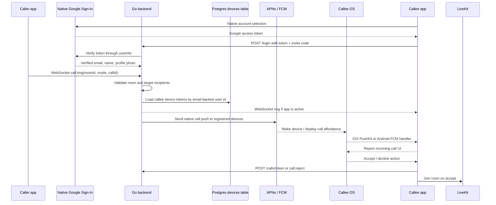

# Real Phone Call Delivery Plan

This plan tracks the work required for Phone LevelG to behave like a real phone app: incoming calls must ring even when the app is backgrounded, suspended, locked, or not currently open.

## Status

- Current foreground calls work through WebSocket signaling plus LiveKit media.
- Native wake-up delivery is implemented through APNs/PushKit + CallKit on iOS and FCM + full-screen incoming-call UI on Android.
- Call reject and no-answer events now carry the same call id as the outgoing ring, so the caller's attempt ends immediately with `Call rejected` or `No answer` instead of waiting ambiguously.
- Locked/background validation remains the main open item: the latest release builds are installed, but both platforms still need repeated physical-device tests while locked, backgrounded, and force-closed.
- Google account creation now uses the native Google Sign-In SDK on Android/iOS. AuthSession remains only for web/dev browser flows.
- Message bodies are encrypted on the mobile client before backend persistence. The current phase is server-blind shared room encryption; per-device key exchange is the next hardening phase.
- 1-1 encrypted attachments are implemented for pictures and documents. The backend stores opaque encrypted blobs and the encrypted chat message carries the private filename/type metadata.
- 1-1 private-message notifications can use the bundled `message-notification.mp3` sound. The lobby intentionally remains silent.
- Chat and attachment encryption now use a server-confirmed session key secret returned at login instead of mutable local invite-code UI state. The mobile session key was bumped so old broken sessions must sign in again.
- Direct-chat delete and attachment endpoints now handle URL-encoded `dm:` room IDs, and mobile send/attachment buttons no longer depend on WebSocket state because persistence uses HTTP.
- OpenShift backend deployment now uses a Git-sourced BuildConfig. Backend images are built by OpenShift build pods from committed GitHub source; mobile binaries, local build directories, and Secret objects must not be uploaded through the tracked runtime manifests.

## Architecture Target

## Tasks

### Planning And Current-State Mapping

- [x] Identify current foreground call path: WebSocket `call:ring`, `call:end`, `call:reject`.
- [x] Confirm LiveKit is media-only and backend currently only mints JWTs.
- [x] Confirm current limitation: no suspended-app delivery without native push.
- [x] Write this implementation plan and keep it updated as work progresses.

### Backend Device Registry

- [x] Add `devices` table to Postgres migration.
- [x] Key devices by normalized email-backed `user_id`.
- [x] Store `device_id`, `platform`, `push_token`, `push_token_type`, `app_version`, `created_at`, `last_seen_at`.
- [x] Add `POST /devices/register`.
- [x] Add `DELETE /devices/{deviceID}` or logout cleanup endpoint.
- [x] Add tests for registering, updating, and replacing device tokens.
- [x] Enforce one account row per normalized email across Android and iPhone logins.
- [x] Allow up to 3 physical devices per email account, with iOS APNs and VoIP token rows counting as one physical device.
- [x] Add tests that a call to one email account fans out to every registered device for that account.
- [x] Deploy the hardened email/device model to OpenShift.
- [x] Clear OpenShift users, devices, messages, and call attempts after the hardened model is deployed.

### Google OAuth Account Identity

- [x] Add Expo AuthSession Google OAuth flow with `openid profile email` scopes for web/dev browser fallback.
- [x] Replace Android/iOS browser OAuth with native `@react-native-google-signin/google-signin` to comply with Google's mobile OAuth policy.
- [x] Install/link native Google Sign-In dependencies on Android and iOS.
- [x] Inject iOS `GOOGLE_REVERSED_CLIENT_ID` from local `GoogleService-Info.plist` during release builds.
- [x] Read Google `userinfo` claims for verified email, display name, and profile photo.
- [x] Remove typed email/display-name account creation from Android and iPhone release UI.
- [x] Send the Google OAuth access token to the backend login endpoint.
- [x] Make the backend derive `accountEmail`, `displayName`, and `avatarURL` from Google `userinfo` when a Google token is supplied.
- [x] Reject login when Google does not return a verified email.
- [x] Keep the invite code as the private-server admission secret after Google identity is verified.
- [x] Add backend tests for verified Google-token login, unverified email rejection, and same-Gmail multi-device login.
- [x] Add mobile validation that Google login is the only production account creation path.
- [x] Document Google OAuth client IDs for Android and iOS release builds.
- [x] Validate native Google Sign-In release flow on Android/iOS devices.

### Backend Call Push Dispatch

- [x] Add call IDs to outgoing call attempts.
- [x] Add call expiration timestamp to ring payloads.
- [x] Resolve direct-call recipients by email-backed user id.
- [x] Keep WebSocket delivery as fast path for active clients.
- [x] Send native push to every registered recipient device through a provider abstraction.
- [x] Do not send push back to caller devices.
- [x] Add tests that `call:ring` dispatches both WebSocket and native push work.
- [x] Persist call attempts for retry/audit.
- [x] Attach concrete APNs and FCM provider implementations.

### Push Providers And Secrets

- [x] Add APNs provider configuration to backend.
- [x] Add FCM provider configuration to backend.
- [x] Add Firebase service-account JSON support so OpenShift can mint FCM OAuth tokens automatically.
- [x] Add OpenShift secret keys for APNs and FCM without committing real credentials.
- [x] Add deployment manifest/env wiring for APNs and FCM.
- [x] Ensure missing push credentials fail gracefully in local development.
- [x] Add real `FCM_SERVICE_ACCOUNT_JSON` to the OpenShift `phone-levelg-server` secret.
- [x] Add the real Firebase `google-services.json` to `apps/mobile/android/app/` before release builds.
- [x] Enroll/use a paid Apple Developer Program team for `io.levelg.phone`.
- [ ] Enable Push Notifications for the explicit `io.levelg.phone` App ID.
- [ ] Regenerate/download an iOS development or distribution provisioning profile that contains `aps-environment`.

### iOS PushKit And CallKit

- [x] Add native PushKit registration.
- [x] Send VoIP token to `/devices/register`.
- [x] Handle VoIP push while app is suspended.
- [x] Immediately report incoming call through CallKit.
- [x] Wire CallKit accept to LiveKit join.
- [x] Wire CallKit decline/end to backend `call:reject` / `call:end`.
- [x] Clear stale CallKit calls on expiration or remote end.
- [ ] Validate on a locked physical iPhone.

### Android FCM And Full-Screen Calls

- [x] Add first-pass FCM registration through Expo native device push tokens.
- [x] Send FCM token to `/devices/register`.
- [x] Do not block FCM device-token registration behind Android notification permission.
- [x] Apply the Google Services Gradle plugin automatically when `google-services.json` exists.
- [x] Send Android call pushes as high-priority FCM data messages.
- [x] Handle high-priority data message in background/killed states.
- [x] Add native full-screen incoming-call activity and notification builder.
- [x] Show full-screen incoming-call notification from native call metadata.
- [x] Wire native Accept and Decline notification actions.
- [x] Route Android native Decline actions into the backend rejection path.
- [x] Reuse `rockstar.mp3` ringtone and vibration pattern.
- [x] Attach Firebase Messaging service to invoke native full-screen call notification from real FCM data pushes.
- [ ] Validate on a locked Android device or emulator with Play Services.
- [ ] Evaluate Telecom/ConnectionService as a follow-up for deeper phone integration.

### Mobile App State And UX

- [x] Persist a stable per-install device id.
- [x] Register APNs/FCM-style native push token after login restore and successful login.
- [x] Re-register device when the native push token rotates.
- [x] Best-effort unregister current device on logout.
- [x] Deduplicate foreground WebSocket ring and native push ring for the same `callId`.
- [x] Persist pending incoming call metadata long enough for native action handling.
- [x] Ensure expired pushes do not show call UI.
- [x] Ensure caller sees `Call rejected`, `Call ended`, or `No answer`.
- [x] Preserve caller-generated call ids through backend `call:ring`, `call:end`, and `call:reject` events.
- [x] End the caller's active attempt immediately when the callee rejects or ignores the matching call.
- [x] Replace the video-call waiting placeholder with phone-style contact avatar/name/status.
- [x] Switch video camera by logical front/back facing mode instead of cycling every physical iPhone rear lens.
- [x] Use stable 720p/30fps video capture constraints to avoid poor low-light tablet camera selections.
- [x] Add a dedicated 1-1 private-message notification sound from `ringtones/message-notification.mp3`.
- [x] Keep lobby message notifications silent.
- [x] Add a local in-app toggle for private-message notification sound.
- [x] Route Android native Answer actions into the existing LiveKit join path.
- [ ] Keep local and remote video behavior unchanged after push-based entry.

### Encrypted Messaging

- [x] Add a dedicated encrypted-message phase to this plan.
- [x] Use a proven authenticated encryption primitive instead of custom cryptography.
- [x] Encrypt outgoing message bodies on Android/iOS before HTTP persistence.
- [x] Store only versioned encrypted message envelopes in the existing backend message body column for new messages.
- [x] Decrypt fetched message history locally before rendering.
- [x] Decrypt live websocket `message:new` payloads locally before rendering.
- [x] Keep legacy plaintext message rows readable during rollout.
- [x] Increase backend message-size validation to account for encrypted envelope overhead.
- [x] Add native validation coverage that the composer sends ciphertext, not plaintext.
- [x] Add direct-chat encrypted attachment storage for pictures and documents.
- [x] Keep attachment blobs opaque to the backend and store encrypted filename/type metadata in the encrypted message envelope.
- [x] Restrict attachment upload/download to direct-chat participants.
- [x] Delete direct-chat attachments when the direct chat history is deleted.
- [x] Add backend integration coverage for direct-chat attachment access and cleanup.
- [x] Add mobile validation coverage for encrypted document/photo picker wiring.
- [x] Add iOS photo-library usage permission to prevent crashes when selecting encrypted pictures.
- [x] Add Android modern and legacy photo-library permissions for encrypted picture selection.
- [x] Use picker-provided base64 bytes for encrypted pictures and documents, with URI fallbacks for platform providers.
- [x] Persist attachment metadata through a throwing message path so Android/iOS upload failures are not swallowed.
- [x] Move direct-chat encryption from local invite-code state to a server-confirmed session key secret.
- [x] Force fresh mobile login sessions after the encryption-key contract change.
- [x] Add backend and mobile validation tests so text, attachment metadata, and attachment blob encryption use the same session key secret.
- [x] Decode URL-encoded direct-chat room IDs on the backend so delete and attachment endpoints accept mobile path encoding.
- [x] Keep Android/iOS chat send and attachment controls enabled during WebSocket reconnects because messages persist over HTTP.
- [ ] Replace shared invite-code-derived room keys with per-account/per-device key material.
- [ ] Add encrypted room-key fan-out for up to three devices per Gmail account.
- [ ] Add message-authentication failure UI that distinguishes wrong-key history from normal empty chats.
- [ ] Add backend tests that message storage treats encrypted envelopes as opaque text.
- [ ] Add richer inline image previews after decrypting downloaded photo attachments.

### Test Coverage

- [x] Add backend integration tests for device registration, token update, and logout delete.
- [x] Add backend unit coverage for rejecting invalid device registration payloads.
- [x] Add backend integration tests for call IDs, expiration, recipient resolution, and push fan-out.
- [x] Add backend integration tests for persisted call attempts and target device rows.
- [x] Add native project validation for mobile push-token registration wiring.
- [x] Add backend tests for missing APNs/FCM credentials graceful behavior.
- [x] Add backend tests for APNs/FCM call payload shaping.
- [x] Add native project validation for mobile call-id dedupe, pending call persistence, and expired push handling.
- [x] Add native project validation for caller-side unanswered-call timeout.
- [x] Add native project validation for Android full-screen call activity, notification, ringtone, and action wiring.
- [x] Add native project validation for Android Firebase Messaging background-call handling.
- [x] Add native project validation for Android native Answer deep-link handling.
- [x] Add iOS native validation hooks for PushKit registration, CallKit reporting, and CallKit event recovery.
- [x] Add iOS native validation hooks for PushKit token bridging and backend registration.
- [x] Add iOS native tests or deterministic validation hooks for PushKit/CallKit expiration.
- [x] Add Android native tests or deterministic validation hooks for FCM background handling and full-screen actions.
- [x] Add end-to-end call tests covering foreground incoming/outgoing call UI paths.
- [ ] Add end-to-end call tests covering background and locked-device paths.

### Deployment And Validation

- [x] Run backend unit tests.
- [x] Run mobile typecheck and native asset checks.
- [x] Change OpenShift backend BuildConfig from binary uploads to GitHub source.
- [x] Document that OpenShift builds backend images from GitHub source and never receives mobile binaries.
- [x] Add manifest validation that rejects Binary BuildConfigs.
- [x] Split real OpenShift Secret objects out of runtime manifests into ignored local YAML plus tracked example YAML.
- [x] Deploy backend to OpenShift.
- [x] Build iOS Release app.
- [x] Build Android Release APK.
- [x] Install latest iOS Release app on both connected iPhones.
- [x] Install Android Release app on emulator/device.
- [x] Test native Google Sign-In on release builds.
- [ ] Test foreground call.
- [ ] Test iPhone locked/background incoming call.
- [ ] Test Android locked/background incoming call.
- [ ] Test direct-chat cleanup still works with email-backed user ids.

## Notes

- iOS VoIP pushes must be used only for real calls and must report to CallKit promptly.
- iOS registers both the regular APNs token and the PushKit VoIP token. Locked/suspended iPhone behavior still needs physical-device validation with valid APNs credentials.
- The latest iOS release device build installs on both connected iPhones through the paid Apple Developer team. Push entitlement and APNs behavior still need locked-device validation.
- APNs/FCM credentials must never be committed to the repository.
- Email remains the stable user identity. Display name is presentation only.
- Push delivery complements WebSocket signaling; it does not replace LiveKit for media.
- Current encrypted messaging prevents the backend and database from reading new message bodies, but it derives room keys from the private invite code plus room ID. Treat that as the first privacy phase, not final Signal-grade multi-device end-to-end encryption.

## Locked-Device Validation Path

Use this path when validating the remaining real-phone behavior:

1. Open Xcode > Settings > Accounts and refresh/download profiles for the paid Apple Developer team.
2. In Apple Developer > Certificates, Identifiers & Profiles > Identifiers, create or edit explicit App ID `io.levelg.phone`.
3. Enable Push Notifications on `io.levelg.phone`.
4. Regenerate an iOS Development provisioning profile for `io.levelg.phone` that includes `aps-environment`.
5. Rebuild iOS Release with automatic provisioning:
   `xcodebuild -allowProvisioningUpdates -workspace apps/mobile/ios/PhoneLevelG.xcworkspace -scheme PhoneLevelG -configuration Release -sdk iphoneos -derivedDataPath apps/mobile/ios/DerivedData-device ENABLE_USER_SCRIPT_SANDBOXING=NO build`
6. Install the built Release app on both connected iPhones:
   - Carlos's iPhone: `0E794132-0AB9-5FB6-BA0B-F680555A6888`
   - iPhone: `1EF56DCA-836E-5DEE-9C0E-9514B5EE56CF`
7. Log in on both iPhones so the app registers the regular APNs token and PushKit VoIP token with the OpenShift backend.
8. Run locked/background incoming-call tests iPhone-to-iPhone, Android-to-iPhone, and iPhone-to-Android.
9. Mark the locked-device validation tasks complete only after the calls ring while the callee app is backgrounded, locked, and recently force-closed where the OS allows delivery.
