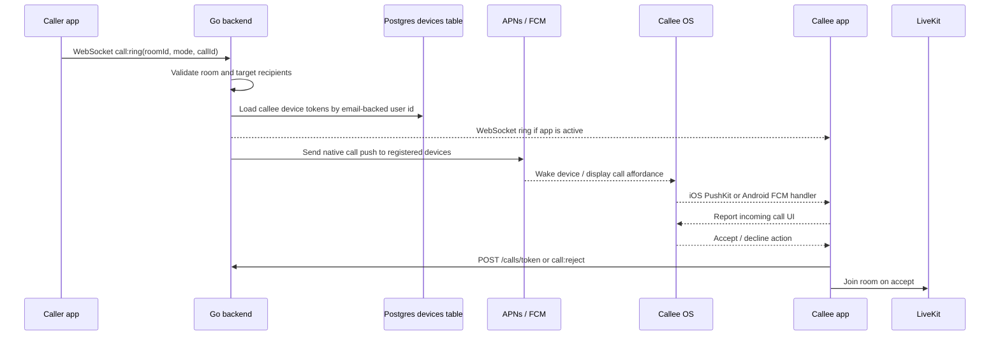

# Real Phone Call Delivery Plan

This plan tracks the work required for Phone LevelG to behave like a real phone app: incoming calls must ring even when the app is backgrounded, suspended, locked, or not currently open.

## Status

- Current foreground calls work through WebSocket signaling plus LiveKit media.
- Background/suspended incoming calls do not work yet because WebSocket delivery stops when the OS suspends the app.
- The correct path is native push delivery: APNs/PushKit + CallKit on iOS, and FCM + full-screen incoming-call notification or Telecom/ConnectionService on Android.

## Architecture Target

## Tasks

### Planning And Current-State Mapping

- [x] Identify current foreground call path: WebSocket `call:ring`, `call:end`, `call:reject`.
- [x] Confirm LiveKit is media-only and backend currently only mints JWTs.
- [x] Confirm current limitation: no suspended-app delivery without native push.
- [x] Write this implementation plan and keep it updated as work progresses.

### Backend Device Registry

- [x] Add `devices` table to Postgres migration.
- [x] Key devices by normalized email-backed `user_id`.
- [x] Store `device_id`, `platform`, `push_token`, `push_token_type`, `app_version`, `created_at`, `last_seen_at`.
- [x] Add `POST /devices/register`.
- [x] Add `DELETE /devices/{deviceID}` or logout cleanup endpoint.
- [x] Add tests for registering, updating, and replacing device tokens.

### Backend Call Push Dispatch

- [x] Add call IDs to outgoing call attempts.
- [x] Add call expiration timestamp to ring payloads.
- [x] Resolve direct-call recipients by email-backed user id.
- [x] Keep WebSocket delivery as fast path for active clients.
- [x] Send native push to every registered recipient device through a provider abstraction.
- [x] Do not send push back to caller devices.
- [x] Add tests that `call:ring` dispatches both WebSocket and native push work.
- [x] Persist call attempts for retry/audit.
- [x] Attach concrete APNs and FCM provider implementations.

### Push Providers And Secrets

- [x] Add APNs provider configuration to backend.
- [x] Add FCM provider configuration to backend.
- [x] Add OpenShift secret keys for APNs and FCM without committing real credentials.
- [x] Add deployment manifest/env wiring for APNs and FCM.
- [x] Ensure missing push credentials fail gracefully in local development.
- [ ] Enroll/use a paid Apple Developer Program team for `io.levelg.phone`.
- [ ] Enable Push Notifications for the explicit `io.levelg.phone` App ID.
- [ ] Regenerate/download an iOS development or distribution provisioning profile that contains `aps-environment`.

### iOS PushKit And CallKit

- [x] Add native PushKit registration.
- [x] Send VoIP token to `/devices/register`.
- [x] Handle VoIP push while app is suspended.
- [x] Immediately report incoming call through CallKit.
- [x] Wire CallKit accept to LiveKit join.
- [x] Wire CallKit decline/end to backend `call:reject` / `call:end`.
- [x] Clear stale CallKit calls on expiration or remote end.
- [ ] Validate on a locked physical iPhone.

### Android FCM And Full-Screen Calls

- [x] Add first-pass FCM registration through Expo native device push tokens.
- [x] Send FCM token to `/devices/register`.
- [x] Send Android call pushes as high-priority FCM data messages.
- [x] Handle high-priority data message in background/killed states.
- [x] Add native full-screen incoming-call activity and notification builder.
- [x] Show full-screen incoming-call notification from native call metadata.
- [x] Wire native Accept and Decline notification actions.
- [x] Route Android native Decline actions into the backend rejection path.
- [x] Reuse `rockstar.mp3` ringtone and vibration pattern.
- [x] Attach Firebase Messaging service to invoke native full-screen call notification from real FCM data pushes.
- [ ] Validate on a locked Android device or emulator with Play Services.
- [ ] Evaluate Telecom/ConnectionService as a follow-up for deeper phone integration.

### Mobile App State And UX

- [x] Persist a stable per-install device id.
- [x] Register APNs/FCM-style native push token after login restore and successful login.
- [x] Re-register device when the native push token rotates.
- [x] Best-effort unregister current device on logout.
- [x] Deduplicate foreground WebSocket ring and native push ring for the same `callId`.
- [x] Persist pending incoming call metadata long enough for native action handling.
- [x] Ensure expired pushes do not show call UI.
- [x] Ensure caller sees `Call rejected`, `Call ended`, or `Unavailable`.
- [x] Route Android native Answer actions into the existing LiveKit join path.
- [ ] Keep local and remote video behavior unchanged after push-based entry.

### Test Coverage

- [x] Add backend integration tests for device registration, token update, and logout delete.
- [x] Add backend unit coverage for rejecting invalid device registration payloads.
- [x] Add backend integration tests for call IDs, expiration, recipient resolution, and push fan-out.
- [x] Add backend integration tests for persisted call attempts and target device rows.
- [x] Add native project validation for mobile push-token registration wiring.
- [x] Add backend tests for missing APNs/FCM credentials graceful behavior.
- [x] Add backend tests for APNs/FCM call payload shaping.
- [x] Add native project validation for mobile call-id dedupe, pending call persistence, and expired push handling.
- [x] Add native project validation for caller-side unanswered-call timeout.
- [x] Add native project validation for Android full-screen call activity, notification, ringtone, and action wiring.
- [x] Add native project validation for Android Firebase Messaging background-call handling.
- [x] Add native project validation for Android native Answer deep-link handling.
- [x] Add iOS native validation hooks for PushKit registration, CallKit reporting, and CallKit event recovery.
- [x] Add iOS native validation hooks for PushKit token bridging and backend registration.
- [x] Add iOS native tests or deterministic validation hooks for PushKit/CallKit expiration.
- [x] Add Android native tests or deterministic validation hooks for FCM background handling and full-screen actions.
- [x] Add end-to-end call tests covering foreground incoming/outgoing call UI paths.
- [ ] Add end-to-end call tests covering background and locked-device paths.

### Deployment And Validation

- [x] Run backend unit tests.
- [x] Run mobile typecheck and native asset checks.
- [x] Deploy backend to OpenShift.
- [x] Build iOS Release app.
- [x] Build Android Release APK.
- [ ] Install latest iOS Release app on both connected iPhones after Push Notifications provisioning is fixed.
- [x] Install Android Release app on emulator/device.
- [ ] Test foreground call.
- [ ] Test iPhone locked/background incoming call.
- [ ] Test Android locked/background incoming call.
- [ ] Test direct-chat cleanup still works with email-backed user ids.

## Notes

- iOS VoIP pushes must be used only for real calls and must report to CallKit promptly.
- iOS registers both the regular APNs token and the PushKit VoIP token. Locked/suspended iPhone behavior still needs physical-device validation with valid APNs credentials.
- The latest iOS release device build is blocked on Apple signing: personal development teams cannot create the Push Notifications provisioning profile required for the `aps-environment` entitlement.
- APNs/FCM credentials must never be committed to the repository.
- Email remains the stable user identity. Display name is presentation only.
- Push delivery complements WebSocket signaling; it does not replace LiveKit for media.
